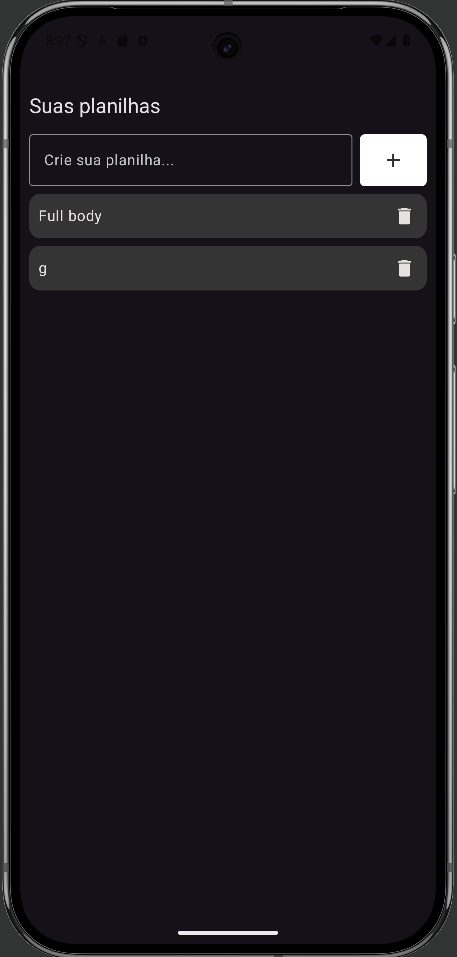
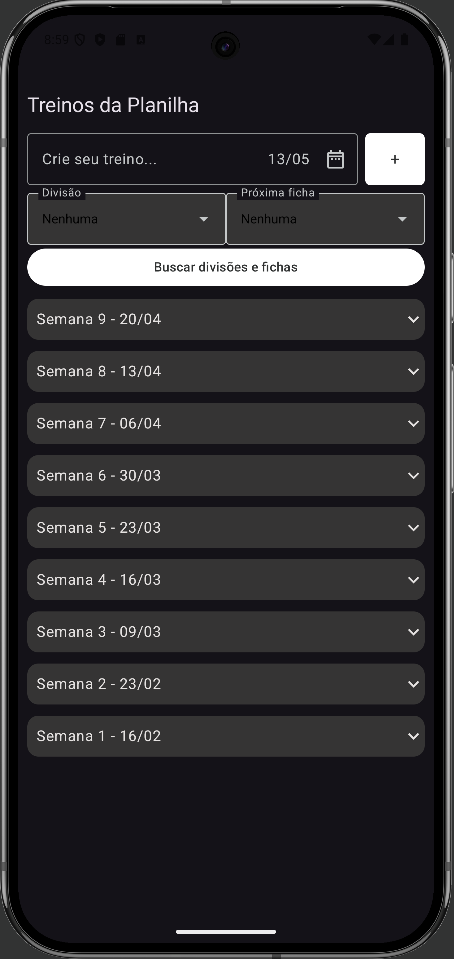
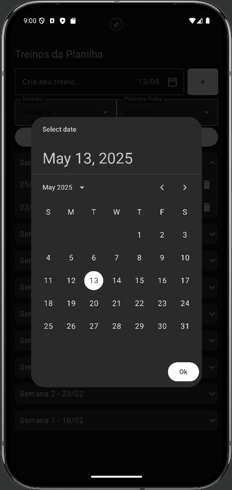
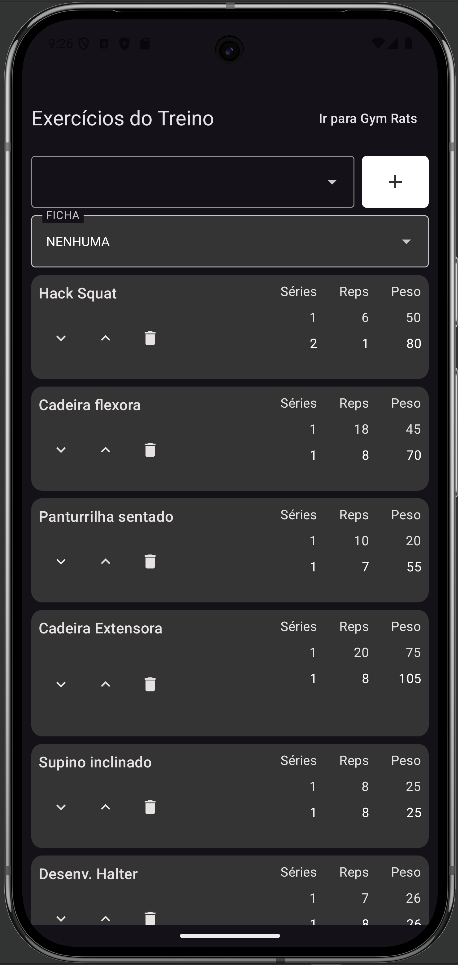
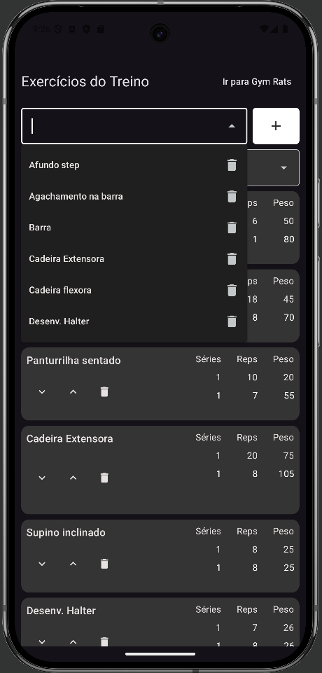
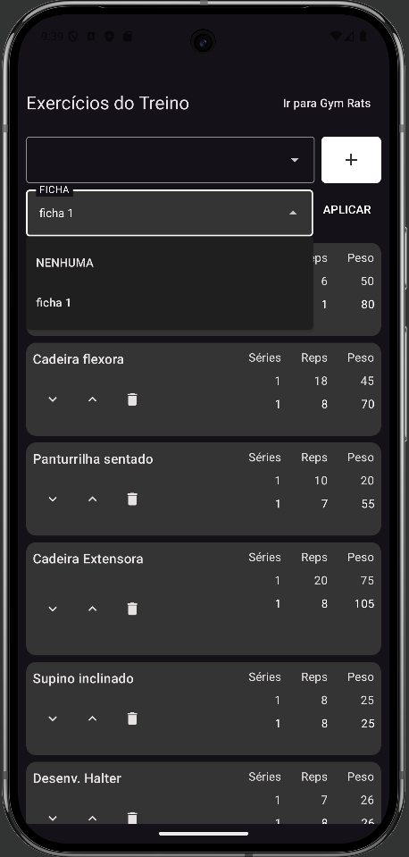
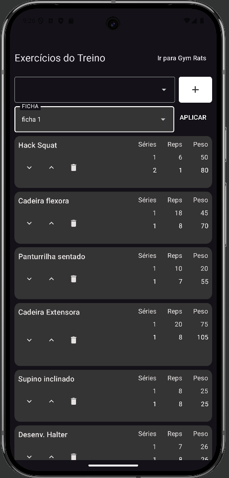
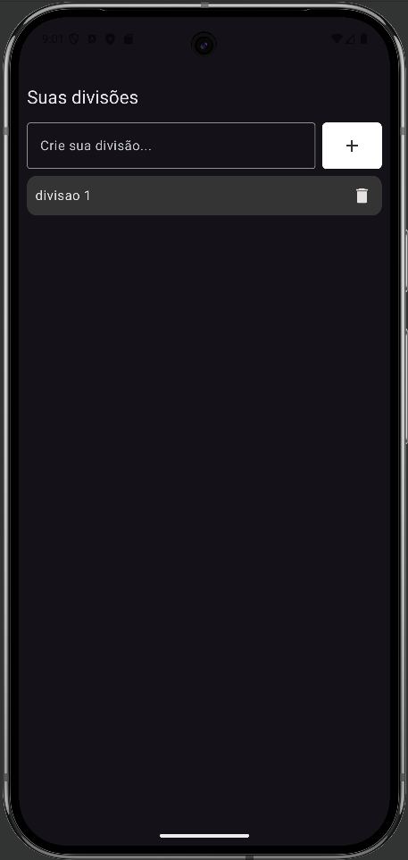
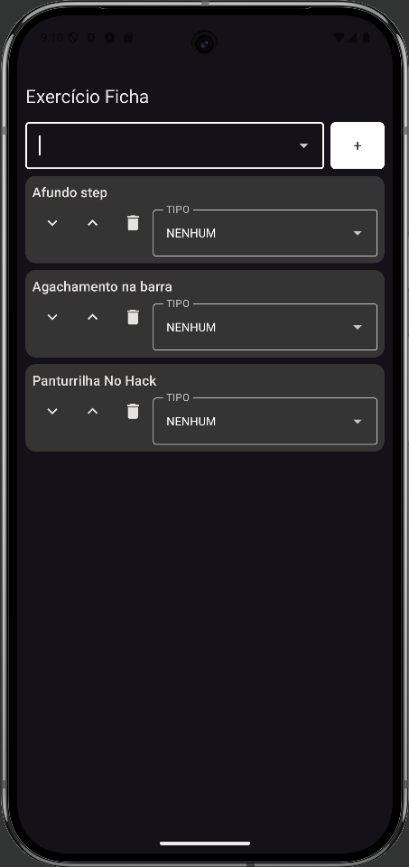
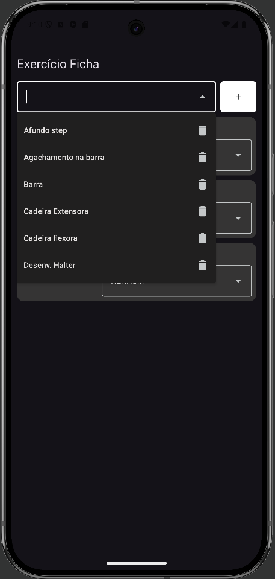

# 🏋️ MyFitt 🏋️

Um aplicativo completo para gerenciar treinos, acompanhar progresso e alcançar objetivos na academia (em breve na Playstore...).

*Aviso* Uma versão atualizada, chamada de v2, está sendo desenvolvida na branch feat/v2.

<p align="center">
  
</p>

## ✨ Funcionalidades

- 📅 **Planejamento de Treinos**: Crie rotinas personalizadas com exercícios, séries e repetições
- 📊 **Acompanhamento de Progresso**: Evolução de cargas e repetição numa UI simples
- ⏱ **Cronômetro de Treino**: Temporizador para descanso entre séries (TODO)
- 🔔 **Lembretes**: Notificações para manter a consistência (TODO)
- 🏆 **Conquistas**: Sistema de recompensas por metas alcançadas (TODO)

## 📥 Como instalar (Android Studio)
 1. Clone o repositório
```bash
git clone https://github.com/seu-usuario/seu-repositorio.git
```
2. Abra o projeto no Android Studio
3. Espere o build do projeto finalizar
4. Escolha um emulador ou dispositivo físico
5. Clique em Run!

## 📸 Capturas de Tela

### Planilhas



### Treinos

   

### Gerenciamento de Exercícios

    

### Divisoes



### Fichas

   

## 🛠 Tecnologias Utilizadas

    Aplicação: Kotlin e Jetpack Compose

    Banco de dados: SQLite (Room)

    Navegação: Compose Navigation

    Ícones: Material Icons

    Design System: Material 3

Guilherme Neis - guilhermeneis132@gmail.com

Link do Projeto: https://github.com/Neiscafe/myfitt
